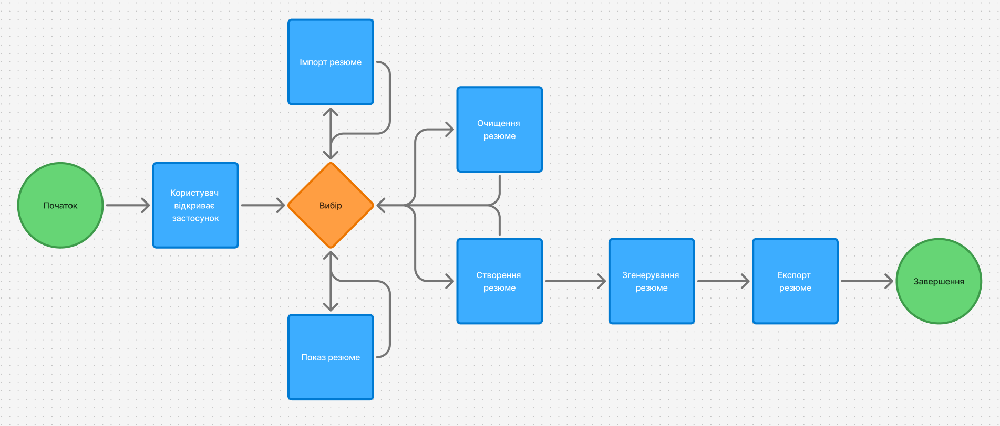

# Конструктор резюме

Це простий односторінковий застосунок, що дозволяє створювати, переглядати, редагувати, зберігати та завантажувати резюме у форматі JSON. Дані зберігаються у `localStorage`.

## Userflow діаграма

## Можливості
- Створення нового резюме через форму
- Перегляд збережених резюме
- Редагування існуючих резюме прямо в інтерфейсі
- Завантаження/експорт резюме у JSON-файл
- Імпорт резюме з JSON-файлу
- Робота без серверної частини (все в браузері)

## Структура коду (JS)

**PersonalInfo** — клас, що зберігає особисту інформацію: ім’я, email, вік. Має геттери/сеттери та метод `display()` для виводу HTML.

**ResumeItem** — базовий абстрактний клас для освітніх даних, досвіду та навичок. Має геттер/сеттер `value` і абстрактний метод `display()`.

**Education** — успадковується від `ResumeItem`, зберігає назву навчального закладу. Має метод `display()`.

**Experience** — успадковується від `ResumeItem`, зберігає назву компанії. Має метод `display()`.

**Skills** — успадковується від `ResumeItem`, зберігає список навичок. Має геттер/сеттер `skills` та метод `display()`.

**Resume** — головний клас, що об'єднує `PersonalInfo`, `Education`, `Experience` та `Skills`. Має метод `render()` для генерації HTML-розмітки резюме.

## Основні функції

- `renderForm()` — генерує форму для введення даних.
- `displaySavedResumes()` — відображає всі збережені резюме.
- `loadJSON()` — імпортує резюме з JSON-файлу.
- `downloadJSON()` — експортує всі збережені резюме у JSON-файл.
- Події кнопок — керують створенням, показом, очищенням, завантаженням та збереженням резюме.
